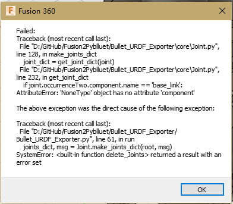
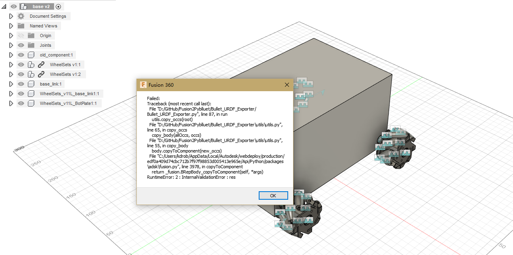

# Fusion2Pybullet

Developed from [@syuntoku14/fusion2urdf](https://github.com/syuntoku14/fusion2urdf). 

### What is this script?

A Fusion 360 script to export urdf files. This is a PyBullet adpative version. 

**03/25/2020 BETA: Supporting exportation of  simple nested components (still didn't figure out where the bug is when dealing with complex models)**

This exports:

* .urdf files of the model
* .stl files of your model
* A example hello.py to load your model into PyBullet.

**If you cannot figure out what went wrong with the model,(usually bugs are caused by wrongly set up joints relationships), please  use the stable version https://github.com/yanshil/Fusion2Pyblluet/tree/stable.**

### Fusion Add-in
Add this script into Fusion 360 via Tools -> Add-Ins


#### Before using this script

1. Some other notes for getting avoid of warnings: 
   1. Change language preference to English
   2. Rename any full-width symbol to half-width symbol (like `。` and `（）`)
2. Set up `base_link`

#### Using script inside Fusion 360: Example

1. Set up the compoenents properly

- [x] A base_link

- [x] Check component and joint names (Set English as the language if necessary)

- [x] **IMPORTANT! Set up joints properly**
	
	* In fusion, when you hit 'J' to assemble joints, note that the exporter consider **component 1 as 'child' and component 2 as 'parent'**. For example, when you want to assemble a 4-wheel car with middle cuboid as `base_link`, you should assemble the vehicle with wheel as component 1 and 'base_link' as component 2.

	* For example, you should be assemble your model to make result of `check_urdf simple_car.urdf`  like the following. i.e. BL, BR, FL, FR as component 1 and base_link as component 2 when you assemble these 4 joints.
	```
    robot name is: simple_car
	  ---------- Successfully Parsed XML ---------------
	  root Link: base_link has 4 child(ren)
	      child(1):  BL_1
	      child(2):  BR_1
	      child(3):  FL_1
	      child(4):  FR_1
	```

2. Run the script and select storing location
   * Note: **Don't save** your file after running the scripts! Some temporary "old component" will be created
   
   * 
   
   * 
   
3. Enjoy from `python hello_bullet.py` !


### Beta Notes

For nested components, there could be tons of things cause problems... 

Here are two I met with but not yet write a better notification. Get avoid of nested components will make things works though

1. 



2. 



### Steps for preparing fusion model for URDF export

* Each link is now stored in its own component within the reformed folder. Changes and edits should be made to these rather than editing the complete model. All components in the complete model are linked to these submodels. This makes it much easier when exporting to URDF.

* For each link, use the combine tool under modify to merge all bodies into a single component.

* Click on that new component and use derive under the create tab. Make sure to click the option to derive a "One Component design". Save this new model in the URDF folder.

* The combined body can now be deleted.

* Repeat this for each of the 7 links until you now have all of the links as single component files.

* Import all the single component files into the URDF model. 

* Unlink all the components.

* The joints can now be set and joint limits can also be defined. (make sure you add the a dummy_base_joint connecting world to the base_link, and add a dummy_end_joint fixed to the last link)

* The URDF can now be run. Be sure to use the version from this GIT to ensure the file directories are set to enable usage in unity.

* A further step is needed to get the dae from stl. Use https://products.aspose.app/3d/conversion/stl-to-dae.
